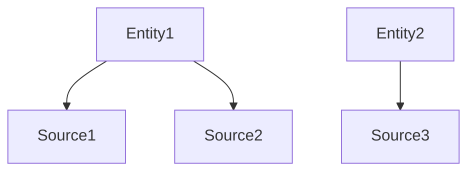
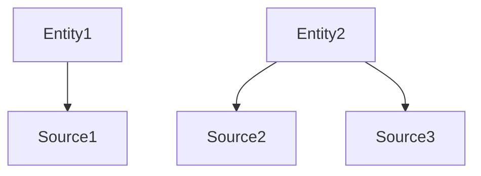
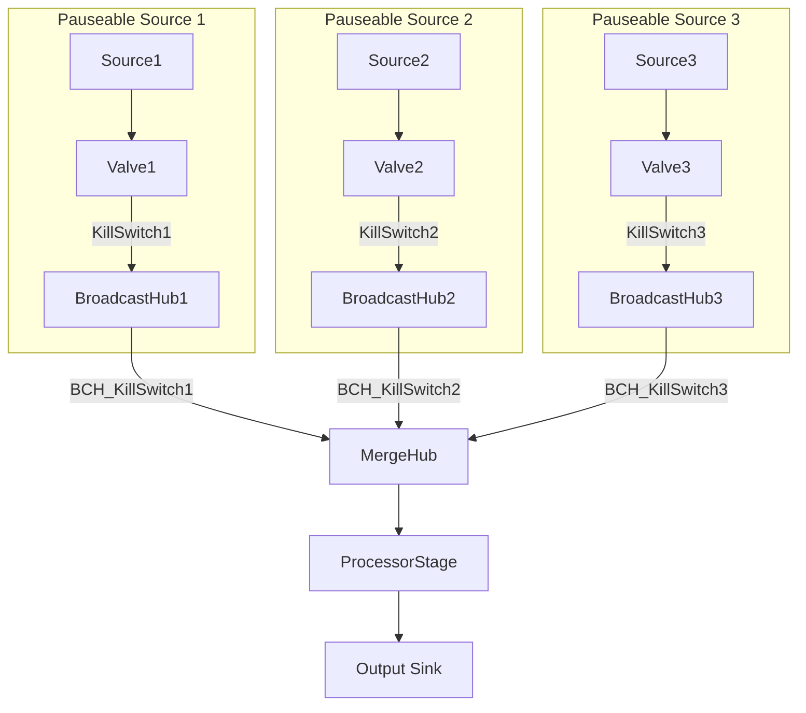

# akka-dynamic-sources-poc

POC of managing a graph where the number of sources is varying, and sources can move from graph to graph

# Demonstration

Consider the following state:

We want to be able to move `Source2` from `Entity1` to `Entity2`, like so:

To achieve that, we'll use the following structure of actors:

# Explanation

## "Pauseable Source" components

* __Source__: is the actual source of data. Can be `Source.range()`, an `AmpqSource.committableSource`, or otherwise
* [__Valve__](https://github.com/akka/akka-stream-contrib/blob/v0.11/src/main/scala/akka/stream/contrib/Valve.scala): allows easy pause-and-resume on sources, for example, when you move the source from one graph to another, so that you'd be able to resume from the same place when you open the valve again.
* [__KillSwitch__]: this is for when you actually want to kill the origin source, when you don't want it's data anymore.
* [__BroadcastHub__]: Although allows for `0-N` consumers, we use it for `0-1`, as it plays as a consumer (pulling from the source) while it is disconnected from a graph, and then you can re-attach the BroadcastHub to another graph.

## Rest of the graph

* [__MergeHub__]: allows for variable amount of producers, which is important when you want to move producers from a graph to another
* [__BCH_KillSwitch__]: it's a KillSwitch between the BroadcastHub and the MergeHub, and it is how you "disconnect" the `PauseableSource` from a graph.

The rest of the components are up to the implementation, in our case we have a GraphStage that processes the input from all the sources, and outputs to a Sink which writes to Kafka.
